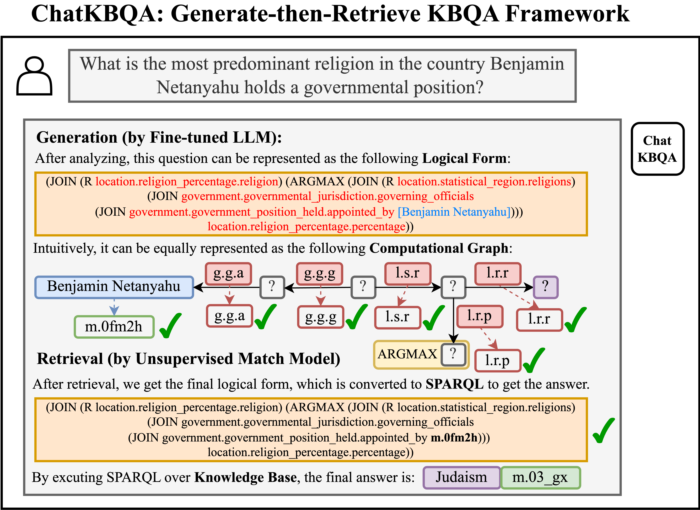

# ChatKBQA

Official resources of **"ChatKBQA: A Generate-then-Retrieve Framework for Knowledge Base Question Answering with Fine-tuned Large Language Models"**. Haoran Luo, Haihong E, Zichen Tang, Shiyao Peng, Yikai Guo, Wentai Zhang, Chenghao Ma, Guanting Dong, Meina Song, Wei Lin, Yifan Zhu, Luu Anh Tuan. **Findings of ACL 2024** \[[paper](https://aclanthology.org/2024.findings-acl.122/)\]. 

[](https://aclanthology.org/2024.findings-acl.122.pdf)
[](https://zhuanlan.zhihu.com/p/663463273)
[](http://www.openkg.cn/tool/bupt-chatkbqa)
[](https://mp.weixin.qq.com/s/htoIZS6s-Uclv2gsVE1MNw)
[](https://mp.weixin.qq.com/s/tIAGhOmhUxl_o_Z2kZwlaQ)
[](https://paperswithcode.com/sota/knowledge-base-question-answering-on-1?p=chatkbqa-a-generate-then-retrieve-framework)
<!-- [](https://paperswithcode.com/sota/knowledge-base-question-answering-on?p=chatkbqa-a-generate-then-retrieve-framework) -->

##  Overview 




##  General Setup 

### Environment Setup
```
conda create -n chatkbqa python=3.8
conda activate chatkbqa
pip install torch==1.13.1+cu117 torchvision==0.14.1+cu117 torchaudio==0.13.1 --extra-index-url https://download.pytorch.org/whl/cu117
pip install -r requirement.txt
```

###  Freebase KG Setup

Below steps are according to [Freebase Virtuoso Setup](https://github.com/dki-lab/Freebase-Setup). 
#### How to install virtuoso backend for Freebase KG.

1. Clone from `dki-lab/Freebase-Setup`:
```
cd Freebase-Setup
```

2. Processed [Freebase](https://developers.google.com/freebase) Virtuoso DB file can be downloaded from [Dropbox](https://www.dropbox.com/s/q38g0fwx1a3lz8q/virtuoso_db.zip) or [Baidu Netdisk](https://pan.baidu.com/s/1F0ytk74p8PGQ0tgAMu9--g?pwd=cp1j) (WARNING: 53G+ disk space is needed):
```
tar -zxvf virtuoso_db.zip
```

3. Managing the Virtuoso service:

To start service at `localhost:3001/sparql`:
```
python3 virtuoso.py start 3001 -d virtuoso_db
```

and to stop a currently running service at the same port:
```
python3 virtuoso.py stop 3001
```

A server with at least 100 GB RAM is recommended.

#### Download FACC1 mentions for Entity Retrieval.

- Download the mention information (including processed [FACC1](https://github.com/HXX97/GMT-KBQA/blob/main/data/common_data/facc1/README.md) mentions and all entity alias in Freebase) from [OneDrive](https://1drv.ms/u/s!AuJiG47gLqTznjl7VbnOESK6qPW2?e=HDy2Ye) or [Baidu Netdisk](https://pan.baidu.com/s/1qbKP2DV1lo9jlYoBxpyTHA?pwd=qzb7) to `data/common_data/facc1/`.

```
ChatKBQA/
└── data/
    ├── common_data/                  
        ├── facc1/   
            ├── entity_list_file_freebase_complete_all_mention
            └── surface_map_file_freebase_complete_all_mention                                           
```

## Dataset

Experiments are conducted on 2 KBQA benchmarks WebQSP, CWQ.

### WebQSP

[WebQSP](https://www.microsoft.com/en-us/research/publication/the-value-of-semantic-parse-labeling-for-knowledge-base-question-answering-2/) dataset has been downloaded under `data/WebQSP/origin`.

```
ChatKBQA/
└── data/
    ├── WebQSP                  
        ├── origin                    
            ├── WebQSP.train.json                    
            └── WebQSP.test.json                                       
```

### CWQ

[CWQ](https://www.dropbox.com/sh/7pkwkrfnwqhsnpo/AACuu4v3YNkhirzBOeeaHYala) dataset has been downloaded under `data/CWQ/origin`.
```
ChatKBQA/
└── data/
    ├── CWQ                 
        ├── origin                    
            ├── ComplexWebQuestions_train.json                   
            ├── ComplexWebQuestions_dev.json      
            └── ComplexWebQuestions_test.json                              
```


## Data Processing

(1) **Parse SPARQL queries to S-expressions** 

- WebQSP: 

Run `python parse_sparql_webqsp.py` and the augmented dataset files are saved as `data/WebQSP/sexpr/WebQSP.test[train].json`. 

- CWQ: 

Run `python parse_sparql_cwq.py` and the augmented dataset files are saved as `data/CWQ/sexpr/CWQ.test[train].json`.
 

(2) **Prepare data for training and evaluation**

- WebQSP: 

Run `python data_process.py --action merge_all --dataset WebQSP --split test` and `python data_process.py --action merge_all --dataset WebQSP --split train`. The merged data file will be saved as `data/WebQSP/generation/merged/WebQSP_test[train].json`.

Run `python data_process.py --action get_type_label_map --dataset WebQSP --split train`. The merged data file will be saved as `data/WebQSP/generation/label_maps/WebQSP_train_type_label_map.json`.

- CWQ: 

Run `python data_process.py --action merge_all --dataset CWQ --split test` and `python data_process.py --action merge_all --dataset CWQ --split train`. The merged data file will be saved as `data/CWQ/generation/merged/CWQ_test[train].json`.

Run `python data_process.py --action get_type_label_map --dataset CWQ --split train`. The merged data file will be saved as `data/CWQ/generation/label_maps/CWQ_train_type_label_map.json`.

**Note:** You can also get the ChatKBQA processed data from [TeraBox](https://terabox.com/s/1Oa7mz7WlrlqdWRaH_9nnUg) or [Baidu Netdisk](https://pan.baidu.com/s/1ikNCCCtYd9izN0Ok3ozdZA?pwd=j6jk), which should be set in `data/`.
```
ChatKBQA/
└── data/
    ├── CWQ/                 
        ├── generation/    
        ├── origin/
        └── sexpr/  
    └── WebQSP/                 
        ├── generation/    
        ├── origin/
        └── sexpr/                                               
```

(3) **Prepare data for LLM model**

- WebQSP: 

Run `python process_NQ.py --dataset_type WebQSP`. The merged data file will be saved as `LLMs/data/WebQSP_Freebase_NQ_test[train]/examples.json`.

- CWQ: 

Run `python process_NQ.py --dataset_type CWQ` The merged data file will be saved as `LLMs/data/CWQ_Freebase_NQ_test[train]/examples.json`.

**Note:** You can also get the processed ChatKBQA SFT data from [TeraBox](https://terabox.com/s/1YdKSzU3ScdQGkE-6lHV_fA) or [Baidu Netdisk](https://pan.baidu.com/s/1dazyWIQ8nYt5YiLt8yjFSw?pwd=uvd9), which should be set in `LLMs/data`.
```
ChatKBQA/
└── LLMs/
    ├── data/                 
        ├── CWQ_Freebase_NQ_test/                    
        ├── CWQ_Freebase_NQ_train/    
        ├── WebQSP_Freebase_NQ_test/                 
        ├── WebQSP_Freebase_NQ_train/      
        └── dataset_info.json                              
```

## Fine-tuning, Retrieval and Evaluation

The following is an example of [LLaMa2-7b](README.md) fine-tuning and retrieval (num_beam = 15) on WebQSP and [LLaMa2-13b](README.md) fine-tuning and retrieval (num_beam = 8) on CWQ, respectively. 

(1) **Train and test LLM model for Logical Form Generation**

- WebQSP: 

Train LLMs for Logical Form Generation:

```bash
CUDA_VISIBLE_DEVICES=3 nohup python -u LLMs/LLaMA/src/train_bash.py --stage sft --model_name_or_path meta-llama/Llama-2-7b-hf --do_train  --dataset_dir LLMs/data --dataset WebQSP_Freebase_NQ_train --template llama2  --finetuning_type lora --lora_target q_proj,v_proj --output_dir Reading/LLaMA2-7b/WebQSP_Freebase_NQ_lora_epoch100/checkpoint --overwrite_cache --per_device_train_batch_size 4 --gradient_accumulation_steps 4  --lr_scheduler_type cosine --logging_steps 10 --save_steps 1000 --learning_rate 5e-5  --num_train_epochs 100.0 --plot_loss  --fp16 >> train_LLaMA2-7b_WebQSP_Freebase_NQ_lora_epoch100.txt 2>&1 &
```

Beam-setting LLMs for Logical Form Generation:
```bash
CUDA_VISIBLE_DEVICES=3 nohup python -u LLMs/LLaMA/src/beam_output_eva.py --model_name_or_path meta-llama/Llama-2-7b-hf --dataset_dir LLMs/data --dataset WebQSP_Freebase_NQ_test --template llama2 --finetuning_type lora --checkpoint_dir Reading/LLaMA2-7b/WebQSP_Freebase_NQ_lora_epoch100/checkpoint --num_beams 15 >> predbeam_LLaMA2-7b_WebQSP_Freebase_NQ_lora_epoch100.txt 2>&1 &
```
```bash
python run_generator_final.py --data_file_name Reading/LLaMA2-7b/WebQSP_Freebase_NQ_lora_epoch100/evaluation_beam/generated_predictions.jsonl
```

- CWQ: 

Train LLMs for Logical Form Generation:
```bash
CUDA_VISIBLE_DEVICES=2 nohup python -u LLMs/LLaMA/src/train_bash.py --stage sft --model_name_or_path meta-llama/Llama-2-13b-hf --do_train  --dataset_dir LLMs/data --dataset CWQ_Freebase_NQ_train --template default  --finetuning_type lora --lora_target q_proj,v_proj --output_dir Reading/LLaMA2-13b/CWQ_Freebase_NQ_lora_epoch10/checkpoint --overwrite_cache --per_device_train_batch_size 4 --gradient_accumulation_steps 4  --lr_scheduler_type cosine --logging_steps 10 --save_steps 1000 --learning_rate 5e-5  --num_train_epochs 10.0 --plot_loss  --fp16 >> train_LLaMA2-13b_CWQ_Freebase_NQ_lora_epoch10.txt 2>&1 &
```

Beam-setting LLMs for Logical Form Generation:
```bash
CUDA_VISIBLE_DEVICES=3 nohup python -u LLMs/LLaMA/src/beam_output_eva.py --model_name_or_path meta-llama/Llama-2-13b-hf --dataset_dir LLMs/data --dataset CWQ_Freebase_NQ_test --template default --finetuning_type lora --checkpoint_dir Reading/LLaMA2-13b/CWQ_Freebase_NQ_lora_epoch10/checkpoint --num_beams 8 >> predbeam_LLaMA2-13b_CWQ_Freebase_NQ_lora_epoch10.txt 2>&1 &
```
```bash
python run_generator_final.py --data_file_name Reading/LLaMA2-13b/CWQ_Freebase_NQ_lora_epoch10/evaluation_beam/generated_predictions.jsonl
```

(2) **Evaluate KBQA result with Retrieval**

- WebQSP: 

Evaluate KBQA result with entity-retrieval and relation-retrieval:
```bash
CUDA_VISIBLE_DEVICES=1 nohup python -u eval_final.py --dataset WebQSP --pred_file Reading/LLaMA2-7b/WebQSP_Freebase_NQ_lora_epoch100/evaluation_beam/beam_test_top_k_predictions.json >> predfinal_LLaMA2-7b_WebQSP_Freebase_NQ_lora_epoch100.txt 2>&1 &
```

Evaluate KBQA result with golden-entities and relation-retrieval:
```bash
CUDA_VISIBLE_DEVICES=4 nohup python -u eval_final.py --dataset WebQSP --pred_file Reading/LLaMA2-7b/WebQSP_Freebase_NQ_lora_epoch100/evaluation_beam/beam_test_top_k_predictions.json --golden_ent >> predfinalgoldent_LLaMA2-7b_WebQSP_Freebase_NQ_lora_epoch100.txt 2>&1 &
```

- CWQ: 

Evaluate KBQA result with entity-retrieval and relation-retrieval:
```bash
CUDA_VISIBLE_DEVICES=4 nohup python -u eval_final_cwq.py --dataset CWQ --pred_file Reading/LLaMA2-13b/CWQ_Freebase_NQ_lora_epoch10/evaluation_beam/beam_test_top_k_predictions.json >> predfinal_LLaMA2-13b_CWQ_Freebase_NQ_lora_epoch10.txt 2>&1 &
```

Evaluate KBQA result with golden-entities and relation-retrieval:
```bash
CUDA_VISIBLE_DEVICES=5 nohup python -u eval_final_cwq.py --dataset CWQ --pred_file Reading/LLaMA2-13b/CWQ_Freebase_NQ_lora_epoch10/evaluation_beam/beam_test_top_k_predictions.json --golden_ent >> predfinalgoldent_LLaMA2-13b_CWQ_Freebase_NQ_lora_epoch10.txt 2>&1 &
```

**Note:** You can also get the ChatKBQA checkpoints and evaluations from [TeraBox](https://terabox.com/s/1Iq8u4M1lQHI2iIMYTNJmUw) or [Baidu Netdisk](https://pan.baidu.com/s/1I5j_FktPF5R0hI1In1qlkQ?pwd=53p5), which should be set in `Reading/`.
```
ChatKBQA/
└── Reading/
    ├── LLaMA2-7b/                 
        └── WebQSP_Freebase_NQ_lora_epoch100/  
            ├── checkpoint/    
            └── evaluation_beam/  
    └── LLaMA2-13b/                 
        └── CWQ_Freebase_NQ_lora_epoch10/  
            ├── checkpoint/    
            └── evaluation_beam/                                              
```

## BibTex

If you find this work is helpful for your research, please cite:

```bibtex
@inproceedings{luo2024chatkbqa,
    title = "{C}hat{KBQA}: A Generate-then-Retrieve Framework for Knowledge Base Question Answering with Fine-tuned Large Language Models",
    author = "Luo, Haoran  and
      E, Haihong  and
      Tang, Zichen  and
      Peng, Shiyao  and
      Guo, Yikai  and
      Zhang, Wentai  and
      Ma, Chenghao  and
      Dong, Guanting  and
      Song, Meina  and
      Lin, Wei  and
      Zhu, Yifan  and
      Luu, Anh Tuan",
    editor = "Ku, Lun-Wei  and
      Martins, Andre  and
      Srikumar, Vivek",
    booktitle = "Findings of the Association for Computational Linguistics ACL 2024",
    month = aug,
    year = "2024",
    address = "Bangkok, Thailand and virtual meeting",
    publisher = "Association for Computational Linguistics",
    url = "https://aclanthology.org/2024.findings-acl.122",
    pages = "2039--2056",
    abstract = "Knowledge Base Question Answering (KBQA) aims to answer natural language questions over large-scale knowledge bases (KBs), which can be summarized into two crucial steps: knowledge retrieval and semantic parsing. However, three core challenges remain: inefficient knowledge retrieval, mistakes of retrieval adversely impacting semantic parsing, and the complexity of previous KBQA methods. To tackle these challenges, we introduce ChatKBQA, a novel and simple generate-then-retrieve KBQA framework, which proposes first generating the logical form with fine-tuned LLMs, then retrieving and replacing entities and relations with an unsupervised retrieval method, to improve both generation and retrieval more directly. Experimental results show that ChatKBQA achieves new state-of-the-art performance on standard KBQA datasets, WebQSP, and CWQ. This work can also be regarded as a new paradigm for combining LLMs with knowledge graphs (KGs) for interpretable and knowledge-required question answering.",
}
```

For further questions, please contact: luohaoran@bupt.edu.cn.

## Acknowledgement

This repo benefits from [PEFT](https://github.com/huggingface/peft), [LLaMA-Efficient-Tuning](https://github.com/hiyouga/LLaMA-Efficient-Tuning), [SimCSE](https://github.com/princeton-nlp/SimCSE), [GMT-KBQA](https://github.com/HXX97/GMT-KBQA) and [DECAF](https://github.com/awslabs/decode-answer-logical-form). Thanks for their wonderful works.